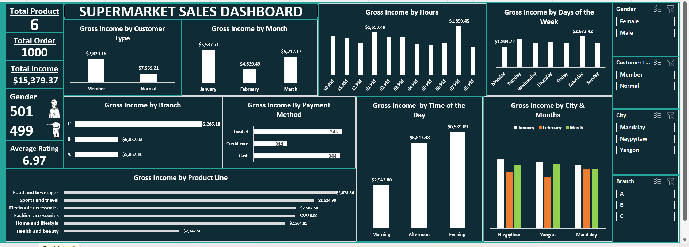
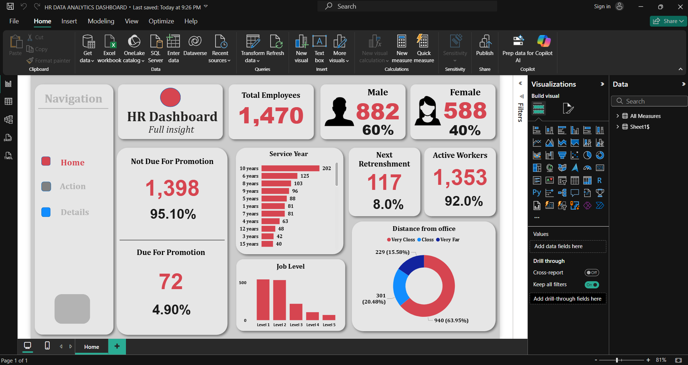

# Data Analytics Portfolio
# Project 1

**Title:** [Vrinda Superstore Sales Analysis](https://github.com/Fadaramaja/Fadaramaja.github.io/blob/main/03%20-%20Data%20Analyst%20Excel%20Project.xlsx)

**Tools Used:** Microsoft Excel (Pivot Table, Pivot Chat, Power Query Editor, Timeline, Slicers, Conditional Formatting)

**Project Description:** 
This project involved analysing sales data of Vrinda Store to identify trends and patterns in overall performance. It is designed to provide a comprehensive overview of key performance metrics. This dashboard allows stakeholders to easily monitor and analyse the company’s performance across different regions, categories, and time periods. The dashboard includes the following features:

1. Revenue by Months: Visual representation of monthly revenue, providing insights into seasonal sales patterns.

2. Revenue by Days of the Week: Breakdown of revenue across weekdays, highlighting the most profitable days.

3. Sales by Gender: Comparative analysis of male vs female customers, showing female customers contributing the majority of sales.

4. Top 5 States: Identification of the states driving the highest sales revenue.

5. Order by Status: Distribution of delivered, returned, cancelled, and refunded orders.

6. Sales by Channel: Sales performance across major platforms such as Amazon, Myntra, Flipkart, Ajio, Meesho, and others.

7. Sales by Category: Breakdown of sales across different product categories (Saree, Kurta, Top, etc.).

8. Sales by Quarter: Quarterly revenue performance for year-over-year trend comparison.

**Key findings:**
1. Customer Demographics: Female customers accounted for the majority of sales revenue.

2. Regional Performance: Maharashtra, Karnataka, and Uttar Pradesh were the top-performing states.

3. Channel Insights: Amazon and Myntra emerged as the strongest sales channels.

4. Category Performance: Set contributed the highest revenue among all product categories.

5. Order Status: A significant portion of orders were successfully delivered, though returns and cancellations highlight areas for operational improvement.

6. Seasonal Trends: Sales peaked in the first quarter and showed a decline towards the year-end, indicating seasonal buying behaviour.

This dashboard serves as a crucial tool for Vrinda Store’s management team, providing clear, actionable insights that drive informed decision-making and strategic planning.

**Dashboard Overview:** 

# Project 2
**Title:** Customer Insight - Data Manipulation And Interrogation

**SQL Code:** [Customer Insight - SQL Codes](https://github.com/Fadaramaja/Fadaramaja.github.io/blob/main/Customer.sql)

**SQL Skills Used:** 
- Data Retrieval (SELECT): Queried and extracted specific information from the database.
- Data Aggregation (SUM, COUNT): Calculated totals, such as sales and quantities, and counted records to analyze data trends.
- Data Filtering (WHERE, BETWEEN, IN, AND): Applied filters to select relevant data, including filtering by ranges and lists.
- Data Source Specification (FROM): Specified the tables used as data sources for retrieval

**Project Description:** 
This project focused on analysing customer and sales data to generate actionable insights that support business decision-making. Using SQL Server, I designed and executed queries to extract, manipulate, and interrogate data from multiple relational tables, including Customers, Orders, and Salesman.

The project involved building reports that combined customer demographics, order details, purchase amounts, and salesman performance to understand sales trends and customer behaviour. Queries were designed to:

- Retrieve customer and order information, including city, order date, and purchase amount.

- Analyze orders by status to evaluate fulfilment efficiency.

- Identify customers without assigned sales representatives for potential sales opportunities.

- Join salesmen and customer data to analyse commission structures and their impact on sales.

- Aggregate purchase amounts and order counts to assess overall sales performance across regions and time periods.

Through this data interrogation, the project highlighted patterns in customer purchases, identified gaps in sales coverage, and provided insights into improving sales strategies.

**Technology used:** SQL server

# Project 3

**Title:** [Supermarket Sales Analysis](https://github.com/Fadaramaja/Fadaramaja.github.io/blob/main/Excel%20SuperMarket_Sales.xlsx)

**Tools Used:** Microsoft Excel (Pivot Table, Pivot Chat, Power Query Editor, Timeline, Slicers, Conditional Formatting)

**Project Description:** 
This project involved the creation of an interactive supermarket sales dashboard in Excel to analyze sales performance across multiple dimensions, including customer type, product line, city, branch, time of day, payment method, and demographics. The dashboard was designed to give management a comprehensive overview of sales trends, gross income distribution, and customer preferences.

The dataset used consisted of 1,000 transactions across 6 product categories. With Excel’s pivot tables, charts, and slicers, the dashboard provides dynamic filtering and visualization for decision-making.

**Key findings:**
1. Total Sales Overview

 - Total income: $15,379.37 from 1,000 orders.

- Average customer rating: 6.97.
- Gender split: 501 females and 499 males (almost equal).

2. Customer Type

- Members contributed slightly more income ($7,820.16) compared to normal customers ($7,559.21).

3. Monthly Performance

- January recorded the highest sales ($5,537.71).

- February had the lowest ($4,629.49).

4. Branch Comparison

- Branch C generated the highest income ($5,265.18).

- Branches A and B generated almost an equal amount in sales.

5. Payment Method

- E-wallet was the most used payment method (345 transactions).

- Followed by Cash (344) and Credit Card (311).

6. Product Line Performance

- Food and Beverages generated the highest income ($2,673.56).

- Health & Beauty was the lowest performer ($2,342.56).

7. Time of Day & Hours

- Evening sales were the highest ($6,589.09), followed by afternoon ($5,847.48).

- Peak hour: 7 PM ($1,890.45).

8. Day of the Week

- Saturday sales were the highest ($2,672.42).

- Monday recorded the lowest ($1,804.72).

9. City Comparison

- Naypyitaw consistently outperformed the other two cities in total sales across months.
  
**Dashboard Overview:** 

# Project 4

**Title:** [HR Data Analysis and Dashboard](https://github.com/Fadaramaja/Fadaramaja.github.io/blob/main/HR%20DATA%20ANALYTICS%20DASHBOARD.pbix)

**Tools Used:** Microsoft Excel for Analysis and Calculated Columns, Power BI for Dashboard 

**Project Description:**
The goal of this project was to build an interactive HR Analytics Dashboard that provides management and HR stakeholders with actionable insights into the workforce. The dashboard is designed to help HR leaders make data-driven decisions on employee promotions, retention, workforce distribution, and workforce planning. 

The dataset for this project was sourced from an Employee HR Excel workbook. To ensure data quality and reliability, I conducted a thorough cleaning process in Excel. I created calculated columns to enrich the dataset. Data types were standardised for consistency across fields. Once the dataset was fully cleaned and validated, it was imported into Power BI for interactive dashboard development and advanced visual analysis.

**Key Findings:**

1. **Workforce Size & Gender Diversity:** In a team of 1,470 total employees, only 40% are Female (588), while the remaining 60% are Male (882). This is an opportunity to improve diversity.

2. **Promotion Readiness:** Only 4.9% are due for promotion. The majority (95.1%) are not yet eligible, which indicates a relatively young or recently promoted workforce.

3. **Retention Risk:** 117 employees (8%) flagged for next retrenchment risk. This group requires close monitoring for possible replacement, training, or intervention.

4. **Workforce Stability:** 92% of employees are active, which reflects stability.

5. **Job Level Insights:** The Majority of employees are in Level 1 and Level 2 roles. Very few employees are in Levels 4 and 5, which points to a limited senior leadership pipeline, and this could pose succession challenges when considering the future of the organisation.

6. **Workplace Proximity:** 64% (940 employees) live very close to the office, which likely improves attendance & productivity. 15.6% (229 employees) live very far, potentially impacting work-life balance and retention.

This dashboard empowers HR leaders with clear visibility into workforce health, promotion cycles, retention risks, and employee demographics, enabling strategic HR decision-making that supports organisational growth.

**Dashboard Overview:**

