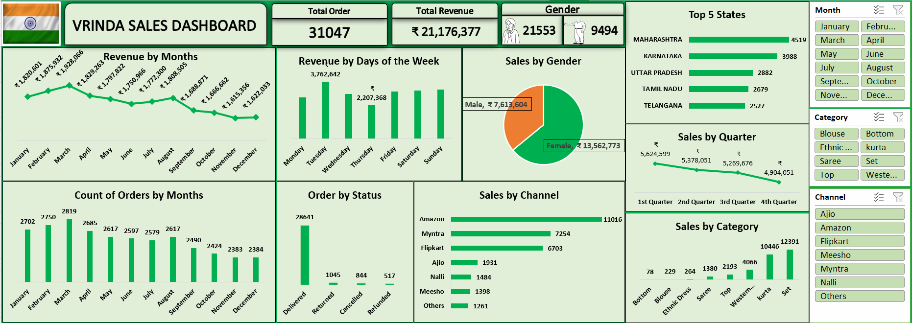
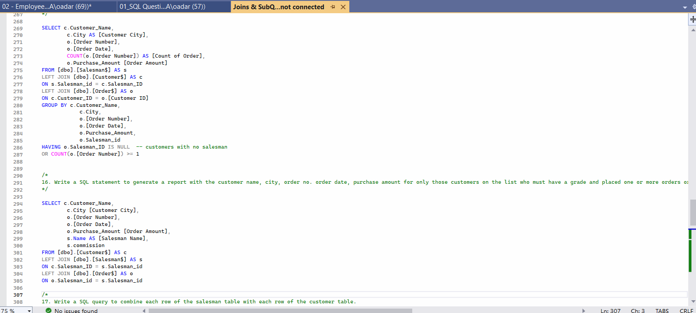

# Data Analytics Portfolio
# Project 1

**Title:** [Vrinda Superstore Sales Analysis](https://github.com/Fadaramaja/Fadaramaja.github.io/blob/main/03%20-%20Data%20Analyst%20Excel%20Project.xlsx)

**Tools Used:** Microsoft Excel (Pivot Table, Pivot Chat, Power Query Editor, Timeline, Slicers, Conditional Formatting)

**Project Description:** 

**Key findings:**

**Dashboard Overview:** 

# Project 2
**Title:** Customer Insight - Data Manipulation And Interrogation

**SQL Code:** [Customer Insight - SQL Codes](https://github.com/Fadaramaja/Fadaramaja.github.io/blob/main/Customer.sql)

**SQL Skills Used:** Data Retrieval (SELECT): Queried and extracted specific information from the database.
Data Aggregation (SUM, COUNT): Calculated totals, such as sales and quantities, and counted records to analyze data trends.
Data Filtering (WHERE, BETWEEN, IN, AND): Applied filters to select relevant data, including filtering by ranges and lists.
Data Source Specification (FROM): Specified the tables used as data sources for retrieval

**Project Description:** 

**Technology used:** SQL Server
